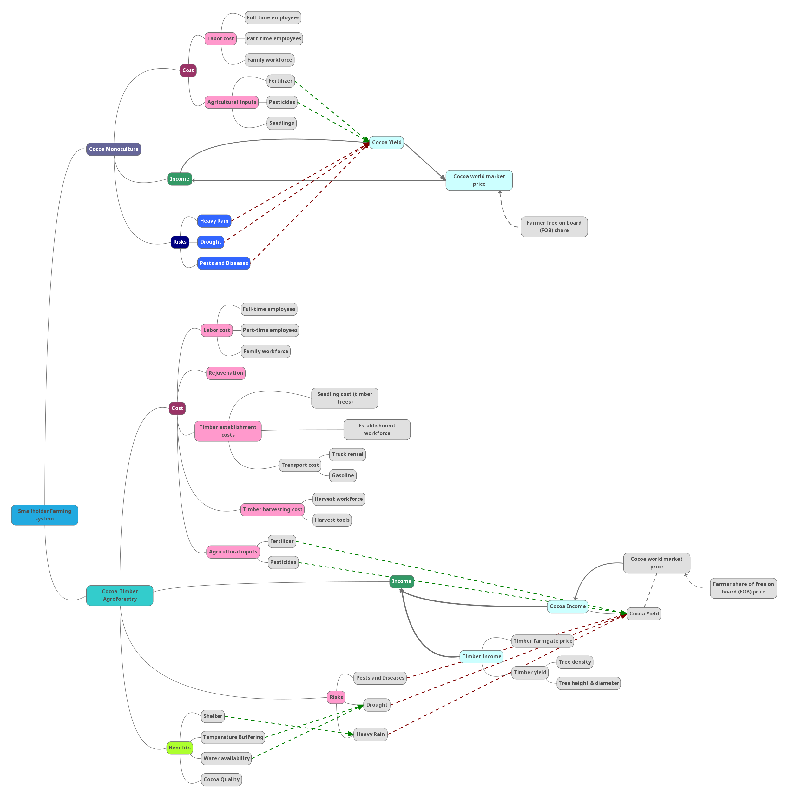

```{r setup, include=FALSE}
library(ggcorrplot)
library(decisionSupport)
library(ggplot2)
library(kableExtra)
library(ggplot2)
library(plyr)
library(dplyr)
library(magrittr)
library(readxl)
knitr::opts_chunk$set(echo = TRUE)
#introducing the make variables function
make_variables <- function(est,n=1)
{ x<-random(rho=est, n=n)
for(i in colnames(x)) assign(i,
                             as.numeric(x[1,i]),envir=.GlobalEnv)}
```
## Introduction

Cameroon ranks as the fifth largest cocoa producer globally, with the sector playing a significant role in the country's rural economy. Production is predominantly carried out by smallholder farmers, whose livelihoods are closely tied to cocoa cultivation. Introduced during the German colonial period as a cash crop, cocoa has since become a cornerstone of agricultural export in Cameroon. Compared to cocoa from some neighboring countries, Cameroonian cocoa is often considered less affected by pesticide residues, enhancing its appeal in increasingly quality-conscious global markets. In recent years, producers have also benefited from favorable world market prices.

Despite its economic significance, cocoa production in Cameroon faces numerous structural and environmental challenges. The international cocoa price remains highly volatile, exposing producers to significant income uncertainty. Input costs can be prohibitively high in remote rural areas, limiting farmers’ ability to invest in yield improvements. Agronomically, cocoa is highly sensitive to temperature fluctuations and drought, and remains vulnerable to a range of pests and diseases, all of which are exacerbated by climate change. Additionally, the sector is hampered by supply chain inefficiencies, including poor infrastructure and limited access to markets, while unsustainable expansion has contributed to deforestation. These issues are further compounded by sociodemographic pressures, such as aging farming populations, limited access to education and extension services, and other inherent constraints to smallholder farming systems.

Recent market trends, however, suggest that cocoa prices may increasingly reflect the growing production risks associated with climate variability, pest pressure, and land-use constraints. Nonetheless, long-term global demand for cocoa is projected to rise steadily, driven by sustained consumption in both emerging and established markets. This continued demand underscores cocoa’s strategic importance not only as a global commodity but also as a source of monetary income for otherwise predominantly subsistence-oriented smallholder farmers. Cocoa is well-suited to agroforestry systems due to its preference for shaded environments, offering opportunities for more sustainable, biodiversity-friendly cultivation practices. Furthermore, the presence of relatively well-established supply chains provides a foundation for interventions aimed at improving value addition, traceability, and farmer livelihoods.

One such improvement could be the introduction of timber trees, such as Erythrophleum ivorense into cocoa plantations. Timber constitutes another popular export product from Cameroon, which is predominantly directed to the European and Chinese market. In Europe, however, exporters of timber have to deal with regulations that aim to reduce illegal logging activities. Trees from agroforestry plantations can thus offer an opportunity for farmers to partake in the timber market in a sustainable way.

## Methodology

As a baseline, cocoa farming in a standard monoculture system on 2-6 hectares are considered. 
The integration would occur in a randomized design with approximately 100-120 trees per hectare. The first harvest of timber is anticipated after approximately 30 years, with the total observed timeframe extending to 50 years. This long-term design allows for the evaluation of both the establishment and maturation phases of timber integration within an agroforestry context and can evaluate the economic development of farms after the onset of economic returns from farming activity. The model observes economical benefits of individual smallholder farmers and does not consider ecological benefits or benefits on a communal or regional scale.

In the cocoa monoculture system, farmer income is solely derived from cocoa yield, which is influenced by labor inputs, agricultural inputs (fertilizer, pesticides, and seedlings), and exposure to environmental risks. Labor costs are disaggregated into full-time and part-time employees, as well as family workforce contributions. Cocoa yield is negatively affected by climatic and biotic stressors, particularly heavy rainfall, drought, and pest and disease outbreaks. These risks represent significant sources of yield variability and income instability. Market prices, including the cocoa world market price and the farmer’s Free on Board (FOB) share, further mediate final cocoa income.
In contrast, the cocoa-timber agroforestry system integrates 120-200 timber trees per hectare into existing cocoa plots. This diversified system introduces additional cost categories, including timber establishment and harvesting costs. Timber establishment costs encompass seedling procurement, workforce for planting, and transport-related expenses such as truck rental and gasoline. Timber harvesting involves further labor and equipment costs. As in monoculture, labor and agricultural input costs remain relevant.
The agroforestry system generates dual income streams from cocoa and timber. Timber income depends on timber yield and farmgate prices, which are in turn influenced by factors such as tree density and the physical characteristics of timber trees (height and diameter). Cocoa income remains tied to cocoa yield and prices, as in the monoculture system.

Where applicable, the above-mentioned factors were then estimated and set as variables. Alternatively, variables that allowed the quantification of those factors were identified and estimated. The estimations were mostly based on literature, but some, namely farm size and yield, as well as employment data were extracted from a survey carried out among 9 farmers in the region of Cameroon Sud.This survey can be accessed [here](https://docs.google.com/forms/d/1HqvVWuC2wZQChxLh2Mdu3DbTOk21pJ9Ffn6OML-6epw/edit#responses) (Access from the authors may be required).
 It is important to mention that any calculations considered the farm as a whole, and the model is not fit to calculate either cost or profit per hectare. Table 1 summarizes the variables created for the decision model in this report.  
 
 
\newpage  


```{r table, echo=FALSE}

Variables_intervention<- read_excel("Variables_Display.xlsx")
knitr::kable(Variables_intervention, caption = "Table 1: Variables used for the Model. Important Note: The Cocoa Price was defined 50 times to model cocoa price volatility. Price ranges 2-50 are not displayed here since they are identical.")%>%
  kable_classic(full_width = F, html_font = "Cambria")%>%
  kable_styling(latex_options = c("scale_down", "landscape"))

```
\newpage

### Intervention modeling

To compare the economic outcomes of cocoa monoculture with an agroforestry system integrating timber, the R package decisionSupport (Luedeling et al., 2019) was applied to perform a Monte Carlo simulation. A model function was developed to incorporate yearly cashflows over a 50-year period under two scenarios: (1) cocoa monoculture and (2) cocoa-timber agroforestry. Both models incorporate production risks (e.g., drought, heavy rainfall, pests), management costs (e.g., labor, fertilizers, pesticides), and market uncertainties (e.g., fluctuating cocoa and timber prices, inflation).
For each model, parameter uncertainty was captured using probabilistic input estimates as explained above. The simulations included 1,000 iterations (mcSimulation) per scenario. Agroforestry included a delayed income stream from timber harvests starting at year 30, along with adjusted risk impacts due to tree presence. Discounted and undiscounted net cashflows were computed for both systems.
Key outputs, such as net present values (NPV) and yearly cashflows, were summarized and compared using the Monte Carlo results. Distribution plots were generated with plot_distributions() to visualize the variability and outcomes across simulations.  
The simulation analysis was further extended by visualizing annual discounted cashflows for both systems using the plot_cashflow() function, which displays the median values along with the 25–75% and 5–95% percentile ranges.   
To assess the influence of uncertain parameters on model outcomes, a multi-variable Expected Value of Perfect Information (EVPI) analysis was conducted using the multi_EVPI() function.
Finally, correlations among key input variables were examined using Pearson correlation coefficients calculated from the Monte Carlo sample (mcSimulation) and visualized with the ggcorrplot package.For that purpose, a correlation matrix was provided as seperate .csv file.

```{r advanced timber, include=FALSE}

model_function_group53 <- function() {
  #call variables
Variables_intervention<- read.csv("Variables_Agroforestry_Timber_clean.csv", row.names = 1)
  make_variables(as.estimate(Variables_intervention))
  #creating constant variables
  n_years <- 50
  n_years_first_harvest<-30
  n_years_establishment<-5
 
  
  farm_size_n<-rep(farm_size, n_years)
  inflation_n<-runif(n_years, min=0.25, max=7.5)
  
  #cocoa monoculture
  #risks
  
    dry_years <- rep(0, n_years)
  dry_years <- chance_event(
    chance = dry_year_incidence,
    value_if = 1 - dry_year_damage,
    value_if_not = 1,
    n = n_years)

  
  rainy_years <- rep(0, n_years)
  rainy_years <- chance_event(
    chance = heavy_rainfall_incidence,
    value_if = 1 - heavy_rainfall_damage,
    value_if_not = 1,
    n = n_years
  )
  
  cocoa_pest_and_diseases <- rep(0, n_years)
  cocoa_pest_and_diseases <-
    chance_event(
      chance = cocoa_pest_and_disease_incidence,
      value_if = 1 - cocoa_pest_and_disease_damage,
      value_if_not = 1,
      n = n_years
    )
  
  #costs
  labor_price_30 <- rep(0, n_years)
  labor_price_30 <- vv(labor_price, 5, n_years)
  family_labor_30 <- rep(0, n_years)
  family_labor_30 <- rep(family_labor, n_years)
  labor_persons_full_time_30 <-
    rep(labor_persons_full_time, n_years)
  labor_persons_seasonal_30 <- rep(labor_persons_seasonal, n_years)
  
  fertilizer_cost_30 <- rep(0, n_years)
  fertilizer_cost_30 <- vv(fertilizer_cost, 20, n_years)
  fertilizer_amount_30 <- rep(0, n_years)
  fertilizer_amount_30 <- vv(fertilizer_amount, 30, n_years)
  fertilizer_effect_30 <- vv(fertilizer_effect, 10, n_years)
  
  pesticide_cost_30 <- rep(0, n_years)
  pesticide_cost_30 <- vv(pesticide_cost, 20, n_years)
  pesticide_frequency_30 <- rep(pesticide_frequency, n_years)
  
  cocoa_harvest_30 <- rep(0, n_years)
  cocoa_harvest_30 <- vv(cocoa_harvest, 5, n_years)
cocoa_price_world_market_n_alt<-vv(cocoa_price_world_market_1,30,n_years, relative_trend = inflation_rate_world)  
cocoa_price_world_market_n <-c(cocoa_price_world_market_1, cocoa_price_world_market_2, cocoa_price_world_market_3, cocoa_price_world_market_4, cocoa_price_world_market_5, cocoa_price_world_market_6, cocoa_price_world_market_7, cocoa_price_world_market_8, cocoa_price_world_market_9, cocoa_price_world_market_10, cocoa_price_world_market_11, cocoa_price_world_market_12, cocoa_price_world_market_13, cocoa_price_world_market_14, cocoa_price_world_market_15, cocoa_price_world_market_16, cocoa_price_world_market_17, cocoa_price_world_market_18, cocoa_price_world_market_19, cocoa_price_world_market_20,cocoa_price_world_market_21, cocoa_price_world_market_22, cocoa_price_world_market_23, cocoa_price_world_market_24, cocoa_price_world_market_25, cocoa_price_world_market_26, cocoa_price_world_market_27, cocoa_price_world_market_28, cocoa_price_world_market_29, cocoa_price_world_market_30, cocoa_price_world_market_31, cocoa_price_world_market_32, cocoa_price_world_market_33, cocoa_price_world_market_34, cocoa_price_world_market_35, cocoa_price_world_market_36, cocoa_price_world_market_37, cocoa_price_world_market_38, cocoa_price_world_market_39, cocoa_price_world_market_40, cocoa_price_world_market_41, cocoa_price_world_market_42, cocoa_price_world_market_43, cocoa_price_world_market_44, cocoa_price_world_market_45, cocoa_price_world_market_46, cocoa_price_world_market_47, cocoa_price_world_market_48, cocoa_price_world_market_49, cocoa_price_world_market_50)
  
  cocoa_price_percent_farmgate_30 <- rep(0, n_years)
  cocoa_price_percent_farmgate_30 <-
    vv(cocoa_price_percent_farmgate, 10, n_years)
  pesticide_effect_30 <- rep(0, n_years)
  pesticide_effect_30 <- rep(pesticide_effect, n_years)
  pest_increase_rain_30 <- rep(0, n_years)
  pest_increase_rain_30 <- rep(pest_increase_rain, n_years)
  
  
  #formula for the harvest considering all production risks and management options
  
  
  #calculating the actual cocoa harvest per farm
  cocoa_farm_harvest_complete <-
    farm_size * cocoa_harvest_30 * dry_years * rainy_years * cocoa_pest_and_diseases * (pesticide_frequency_30 * (1 +                                                  pesticide_effect_30) * (fertilizer_amount_30 * fertilizer_effect_30))
  #income from cocoa
  income <- cocoa_farm_harvest_complete * cocoa_price_world_market_n * cocoa_price_percent_farmgate_30
  #labor_cost
  labor_cost  <-
    labor_persons_full_time_30 * 12 * labor_price_30 + labor_persons_seasonal_30 * 5 * labor_price_30 +
    family_labor * labor_price * 12
  
  pesticide_and_fertilizer_cost <-
    pesticide_cost_30 * farm_size_n * pesticide_frequency_30 + fertilizer_amount_30 *
    fertilizer_cost_30
  
  overall_cost <- pesticide_and_fertilizer_cost + labor_cost
  
  # Estimate the final results from the model
  final_cashflow <- income - overall_cost
  # Generate the list of outputs from the Monte Carlo simulation
  final_result_cocoa <- sum(income - overall_cost)
  
  
  #creating risks modified by tree presence
  
  dry_years <- rep(0, n_years)
  dry_years <- c(chance_event(
    chance = dry_year_incidence,
    value_if = 1 - dry_year_damage*dry_year_damage_establishment,
    value_if_not = 1,
    n = n_years_establishment),chance_event(
    chance = dry_year_incidence,
    value_if = 1 - dry_year_damage*dry_year_damage_establishment,
    value_if_not = 1,
    n = n_years-n_years_establishment))

  
  rainy_years <- rep(0, n_years)
  rainy_years <- c(chance_event(
    chance = heavy_rainfall_incidence,
    value_if = 1 - heavy_rainfall_damage,
    value_if_not = 1,
    n = n_years_establishment), chance_event(
    chance = heavy_rainfall_incidence,
    value_if = 1 - heavy_rainfall_damage*heavy_rainfall_damage_established,
    value_if_not = 1,
    n = n_years-n_years_establishment)
  )
  
  cocoa_pest_and_diseases <- rep(0, n_years)
  cocoa_pest_and_diseases <-
    chance_event(
      chance = cocoa_pest_and_disease_incidence,
      value_if = 1 - cocoa_pest_and_disease_damage,
      value_if_not = 1,
      n = n_years)
  
#considering costs
  #cocoa
  labor_price_n <- rep(0, n_years)
  labor_price_n <- vv(labor_price, 5, n_years)
  family_labor_n <- rep(0, n_years)
  family_labor_n <- rep(family_labor, n_years)
  labor_persons_full_time_n <- rep(labor_persons_full_time, n_years)
  labor_persons_seasonal_n <- rep(labor_persons_seasonal, n_years)
  
  labor_cost  <-labor_persons_full_time_n * 12 * labor_price_n+
  labor_persons_seasonal_n * 5 * labor_price_n +
  family_labor * labor_price * 12
  
  fertilizer_cost_n <- rep(0, n_years)
  fertilizer_cost_n <- vv(fertilizer_cost, 20, n_years)
  fertilizer_amount_n <- rep(0, n_years)
  fertilizer_amount_n <- vv(fertilizer_amount, 30, n_years)
  fertilizer_effect_n <- vv(fertilizer_effect, 10, n_years)
  
  pesticide_cost_n <- rep(0, n_years)
  pesticide_cost_n <- vv(pesticide_cost, 20, n_years)
  pesticide_frequency_n <- rep(pesticide_frequency, n_years)
  
  pesticide_and_fertilizer_cost <-
    pesticide_cost_n * farm_size_n * pesticide_frequency_n + fertilizer_amount_n *
    fertilizer_cost_n
  
    overall_cost_cocoa <- pesticide_and_fertilizer_cost + labor_cost

  #timber (additional)
  seedlings_cost<-c(tree_seedlings*tree_density*farm_size)
  transport_cost<-c(seedling_and_equipment_transport)
  establishment_labor_cost<-c(labor_persons_establishment*(labor_price_n[1])*farm_size*
                              3)
  establishment_cost<-seedlings_cost+transport_cost+establishment_labor_cost
  maintenance_labor_persons<-farm_size_n
  maintenance_labor_cost<-maintenance_labor_persons*labor_price_n
  harvest_cost<-(harvest_material+labor_persons_harvest*labor_price_n[n_years]*
                   farm_size*3)/n_years_first_harvest
  harvest_cost_n<-c(rep(0, n_years_first_harvest),vv(harvest_cost, 5, (n_years-n_years_first_harvest)))
  
  overall_cost_timber<-c(establishment_cost,maintenance_labor_cost[2:(n_years-1)],
                         harvest_cost)
#considering income
  #cocoa
  cocoa_harvest_n <- rep(0, n_years)
  cocoa_harvest_n <- vv(cocoa_harvest, 5, n_years)
  
  cocoa_price_world_market_n <- rep(0, n_years)
  cocoa_price_world_market_n <-c(cocoa_price_world_market_1, cocoa_price_world_market_2, cocoa_price_world_market_3, cocoa_price_world_market_4, cocoa_price_world_market_5, cocoa_price_world_market_6, cocoa_price_world_market_7, cocoa_price_world_market_8, cocoa_price_world_market_9, cocoa_price_world_market_10, cocoa_price_world_market_11, cocoa_price_world_market_12, cocoa_price_world_market_13, cocoa_price_world_market_14, cocoa_price_world_market_15, cocoa_price_world_market_16, cocoa_price_world_market_17, cocoa_price_world_market_18, cocoa_price_world_market_19, cocoa_price_world_market_20,cocoa_price_world_market_21, cocoa_price_world_market_22, cocoa_price_world_market_23, cocoa_price_world_market_24, cocoa_price_world_market_25, cocoa_price_world_market_26, cocoa_price_world_market_27, cocoa_price_world_market_28, cocoa_price_world_market_29, cocoa_price_world_market_30, cocoa_price_world_market_31, cocoa_price_world_market_32, cocoa_price_world_market_33, cocoa_price_world_market_34, cocoa_price_world_market_35, cocoa_price_world_market_36, cocoa_price_world_market_37, cocoa_price_world_market_38, cocoa_price_world_market_39, cocoa_price_world_market_40, cocoa_price_world_market_41, cocoa_price_world_market_42, cocoa_price_world_market_43, cocoa_price_world_market_44, cocoa_price_world_market_45, cocoa_price_world_market_46, cocoa_price_world_market_47, cocoa_price_world_market_48, cocoa_price_world_market_49, cocoa_price_world_market_50)

  
  cocoa_price_percent_farmgate_n <- rep(0, n_years)
  cocoa_price_percent_farmgate_n <- vv(cocoa_price_percent_farmgate, 10, n_years)
  pesticide_effect_n <- rep(0, n_years)
  pesticide_effect_n <- rep(pesticide_effect, n_years)
  pest_increase_rain_n <- rep(0, n_years)
  pest_increase_rain_n <- rep(pest_increase_rain, n_years)
  yield_impact<-c(vv(impact_trees_cocoa_establishment, 5, n_years_establishment),
                  vv(impact_trees_cocoa, 10, n_years-n_years_establishment))
  cocoa_farm_harvest_complete <-
    farm_size_n * cocoa_harvest_n * dry_years * rainy_years * cocoa_pest_and_diseases*
    (pesticide_frequency_n*                                           
       pesticide_effect_n) * (fertilizer_amount_n * fertilizer_effect_n)*yield_impact
    income_cocoa <- cocoa_farm_harvest_complete * cocoa_price_world_market_n *
      cocoa_price_percent_farmgate_n
  
  #timber
  dt_timber_diameter<-vv(tree_growth_diam, 5, n_years)
  harvest_years <- n_years_first_harvest:n_years
  harvest_diameter <- sapply(harvest_years, function(y) sum(dt_timber_diameter[1:y]))/10+tree_initial_diameter
  dt_timber_height<-vv(tree_growth_height,5,n_years)
  harvest_height<-sapply(harvest_years, function(y) sum(dt_timber_height[1:y]))+tree_initial_height
  timber_cm3<-((farm_size*tree_density)/30)*(harvest_diameter/2)^2*pi*harvest_height
  timber_m3<-timber_cm3/1000000
  timber_price_n<-vv(tree_price, 20, n_years)
  income_timber<-c(rep(0,n_years_first_harvest-1), c(timber_m3*timber_price_n[n_years_first_harvest:n_years]))
  
#creating final cashflows and distributions
  #timber
   final_cashflow <- (income_cocoa+income_timber)-(overall_cost_cocoa+overall_cost_timber)
  final_result <- sum(income_cocoa+income_timber) - sum(overall_cost_cocoa+overall_cost_timber)
  #cocoa
  final_cashflow_cocoa<-income_cocoa-overall_cost_cocoa
  final_result_cocoa<-sum(income_cocoa)-sum(overall_cost_cocoa)
  
#applying the discount function
  discounted_income_cocoa<-discount(income_cocoa,inflation_rate_cameroon, n_years)
  discounted_cost_cocoa<-discount(overall_cost_cocoa, inflation_rate_cameroon, n_years)
  discounted_income_timber<-discount(income_timber, inflation_rate_cameroon, n_years)
  discounted_cost_timber<-discount(overall_cost_timber, inflation_rate_cameroon, n_years)
  
  final_result_af_discounted<-discount(final_result, inflation_rate_cameroon, n_years)
  final_result_cocoa_discounted<-discount( final_result_cocoa,inflation_rate_cameroon, n_years)
  cashflow_cocoa_discounted<-discount(final_cashflow_cocoa,inflation_rate_cameroon, calculate_NPV = FALSE)
  cashflow_af_discounted<-discount(final_cashflow, inflation_rate_cameroon, calculate_NPV = FALSE)
  

 return(list(final_result_af = final_result/559,
             final_cashflow_af = final_cashflow/559,
             final_result_cocoa = final_result_cocoa/559,
             final_cashflow_cocoa = final_cashflow_cocoa/559,
             final_result_af_discounted=final_result_af_discounted/559,
             final_result_cocoa_discounted=final_result_cocoa_discounted/559,
             cashflow_cocoa_discounted = cashflow_cocoa_discounted/559,
             cashflow_af_discounted = cashflow_af_discounted/559,
             the_decision = (final_result_af_discounted-final_result_cocoa_discounted)/559
            ))
}

#applying the decision support package
mc_simulation3 <-
  mcSimulation(
    estimate = as.estimate(Variables_intervention),
    model_function = model_function_group53,
    numberOfModelRuns = 1000,
    functionSyntax = "plainNames"
  )
```
### Introduction of Correlations  

To explore the possibility to introduce relationships among key agroforestry variables related to timber and cocoa production, a correlation matrix was constructed. The matrix included nine variables: fertilizer cost, fertilizer amount, pesticide cost, pesticide frequency, cocoa harvest, tree density, seedling and equipment transport, harvest material, and labor persons involved in harvest. Correlation coefficients ranged from -0.5 to 1, reflecting both positive and negative associations among the variables. The correlations were based on own estimations of the author and relied on technical knowledge gained during the project. Nevertheless, they are here used as showcase example only.
The correlation matrix was incorporated into a Monte Carlo simulation framework using the mcSimulation function. The resulting simulated data were visualized with ggcorrplot,

## Results  
### Net present value after 50 years  
```{r distibutions, echo=FALSE}
distribution_plot<-plot_distributions(
  mcSimulation_object = mc_simulation3,
  vars =c("final_result_af_discounted", "final_result_cocoa_discounted"),
  method = "smooth_simple_overlay"
  )
distribution_plot + labs(caption = "Figure 1: Distribution of discounted net results for agroforestry and cocoa monoculture systems.")

```

```{r loss distribution, include = FALSE}
losses_af<-mean(mc_simulation3[["y"]][["final_result_af_discounted"]]<=0)
losses_cocoa<-mean(mc_simulation3[["y"]][["final_result_cocoa_discounted"]]<=0)
peak_index1 <- which.max(mc_simulation3[["y"]][["final_result_af_discounted"]])
peak_index2 <- which.max(mc_simulation3[["y"]][["final_result_cocoa_discounted"]])
max1<-max(mc_simulation3[["y"]][["final_result_af_discounted"]])
max2<-max(mc_simulation3[["y"]][["final_result_cocoa_discounted"]])
min1<-min(mc_simulation3[["y"]][["final_result_af_discounted"]])
min2<-min(mc_simulation3[["y"]][["final_result_cocoa_discounted"]])
```

The generated plot shows the accumulated profit of both cocoa monoculture and timber agroforestry. On first glance, the density distributions of both systems are of similar shape, reaching from `r round(min2)` to `r round(max2)` in case of cocoa monoculture and peaking at approximately `r round(peak_index2)` USD profit. With the intervention, the distribution reaches from simulated scenarios of `r round(min1)` to `r round(max1)`and peaking at `r round(peak_index1)` USD profit respectively. Concerning the risk of losses occurring after 50 years, the density distribution of cocoa monoculture scenarios that return a net profit <= 0 is `r losses_cocoa`, while the same risk to cocoa-timber agroforestry is somewhat lower at `r losses_af`.  
Figure 2 plots the value of the decision, revealing that under all circumstances, the expected value of decision is positive.

```{r decision value, echo = FALSE}
decision_plot<-plot_distributions(
  mcSimulation_object = mc_simulation3,
  vars =c("the_decision"),
  method = "smooth_simple_overlay")
decision_plot + labs(caption = "Figure 2: Expected value of decision: 'Integrating Timber Trees into Cocoa Monoculture plantations'")

```
```{r}
peak_index3 <- which.max(mc_simulation3[["y"]][["the_decision"]])
max3<-max(mc_simulation3[["y"]][["the_decision"]])
min3<-min(mc_simulation3[["y"]][["the_decision"]])
```

The outcome density for the expected value of integrating timber agroforestry into the cocoa plantation reaches from simulated returns of `r round(min3)` to `r round(max3)`. It peaks at `r round(peak_index3)`.  

### Cashflow

**Important note**: To display the variation of income flows, the cashflow was plotted without discount over 50 years.  

```{r cashflows undiscounted, echo = FALSE}
cashflow_cocoa<-plot_cashflow(mcSimulation_object = mc_simulation3, cashflow_var_name = c("final_cashflow_cocoa", "final_cashflow_af"),  x_axis_name = "Years",
              y_axis_name = "Annual cashflow in USD",
              color_25_75 = "lightblue", color_5_95 = "lavenderblush3",
              color_median = "purple")
cashflow_cocoa+labs(caption = "Figure 3: Cashflow simulation of cocoa monoculture (left) and cocoa-timber agroforestry (right)")
```

Figure 3 compares the simulated annual cashflows for cocoa monoculture (final_cashflow_cocoa) and cocoa-timber agroforestry (final_cashflow_af). Both systems exhibit similar overall distributions, with wide uncertainty ranges spanning the 5th to 95th percentiles, reflecting inherent variability in market and production conditions. The median cashflow trajectory (purple line) for the agroforestry system starts at a lower point, but raises quickly and appears slightly higher than that of the monoculture from approximately year 10 onward, suggesting marginal long-term financial benefits associated with the diversified system. Notably, the interquartile range (25th to 75th percentile, lavender-blue area) is consistently wider in both systems, indicating substantial variation in expected outcomes across the simulation runs. However, the agroforestry system maintains slightly higher medians with no marked increase in downside risk. This combination results in 5th to 95th percentiles that seldomly reach below 0 from year 30, while this range reaches below 0 frequently in the cocoa monoculture plot.

##Value of information report
```{r evpi, include=FALSE}
mcSimulation_cocoa_income <- data.frame(mc_simulation3$x, mc_simulation3[["y"]][["final_result_cocoa_discounted"]]
                                 )
#note to myself, no idea why the column name is that weird,  but I don't care as long as it works

evpi_cocoa <- multi_EVPI(mc = mcSimulation_cocoa_income, 
                   first_out_var = "mc_simulation3...y......final_result_cocoa_discounted...")
plot_evpi(evpi_cocoa, decision_vars = "mc_simulation3...y......final_result_cocoa_discounted...")

mcSimulation_cocoa_timber <- data.frame(mc_simulation3$x, 
                                 mc_simulation3$y[1])

evpi_cocoa_timber <- multi_EVPI(mc = mcSimulation_cocoa_timber, 
                   first_out_var = "final_result_af")
plot_evpi(evpi_cocoa_timber, decision_vars = "final_result_af")

mcSimulation_decision<-data.frame(mc_simulation3$x, mc_simulation3[["y"]][["the_decision"]]
                                 )
evpi_decision <- multi_EVPI(mc = mcSimulation_decision, 
                   first_out_var = "mc_simulation3...y......the_decision...")
plot_evpi(evpi_decision, decision_vars = "mc_simulation3...y......the_decision...")
```

The expected value of perfect information for all scenarios (cocoa monoculture, cocoa-timber agroforestry and the decision) is zero, which implies that in these simulations there is no variable that has enough influence on the final result to be worth investigating more. 

```{r correlation, echo=FALSE}
variables<-read.csv("Variables_Agroforestry_Timber_clean.csv")
mat <- matrix(c(
  1,   -0.2,  0.05,  0,    0,    0,    0,    0,    0,
 -0.2,  1,    0,     0,    0.3,    0,    0,    0,    0,
  0.05, 0,    1,    -0.2,  0,    0,    0,    0,    0,
  0,    0,   -0.2,   1,    0,    0,    0,    0,    0,
  0,    0.3,    0,     0,    1,   -0.2,  0,    0,    0,
  0,    0,    0,     0,   -0.2,  1,   -0.5,  0.5,  0.5,
  0,    0,    0,     0,    0,   -0.5,  1,    0,    0,
  0,    0,    0,     0,    0,    0.5,  0,    1,    0,
  0,    0,    0,     0,    0,    0.5,  0,    0,    1
), 
nrow=9, ncol=9, byrow=TRUE)

# Assign row and column names
rownames(mat) <- colnames(mat) <- c(
  "fertilizer_cost", "fertilizer_amount", "pesticide_cost", "pesticide_frequency",
  "cocoa_harvest", "tree_density", "seedling_and_equipment_transport",
  "harvest_material", "labor_persons_harvest")

correlation <- mcSimulation(estimate=as.estimate(variables, correlation_matrix = mat), model_function=model_function_group53, numberOfModelRuns=1000, functionSyntax="plainNames")

correlation_plot<-ggcorrplot(cor(correlation$x[1:20]))
correlation_plot+labs(caption = "Figure 4: Correlations between variables introduced into the model")

```

The correlation plot shows that correlations could successfully be forced into the simulation. Furthermore, it depicts some very small correlations between variables that are not present in the decision matrix, most likely due to random occurrances in model runs.

```{r plots, echo=FALSE}
distribution_plot_corr<-plot_distributions(
  mcSimulation_object = correlation,
  vars =c("final_result_af_discounted", "final_result_cocoa_discounted"),
  method = "smooth_simple_overlay")
decision_plot_corr<-plot_distributions(
  mcSimulation_object = correlation,
  vars =c("the_decision"),
  method = "smooth_simple_overlay")
cashflow_correlation<-plot_cashflow(mcSimulation_object = correlation, cashflow_var_name = c("final_cashflow_cocoa", "final_cashflow_af"),  x_axis_name = "Years",
              y_axis_name = "Annual cashflow in USD",
              color_25_75 = "lightblue", color_5_95 = "lavenderblush3",
              color_median = "purple")
plots<-distribution_plot_corr/ decision_plot_corr /cashflow_correlation
plots+labs(caption = "Figure 5: Density distributions in correlation plot")


```
Figure 5 displays the analytical plots from the model with integrated correlations. There are only small differences between those and the original plots. Due to the fragile nature of the correlation estimations, they will not be discussed further in the scope of this report.

## Discussion  

This study applied a correlation-informed Monte Carlo simulation to evaluate the economic viability and trade-offs between cocoa monoculture and agroforestry systems.

### Net present value comparison between options and cashflow

The distribution plots for the discounted net results suggest that agroforestry systems can outperform cocoa under all simulated scenarios, this may be the result of an inaccurate depiction of production risks to timber production in the model. While for the production of cocoa, several risk factors such as drought or pest damage were considered, these risks were not incorporated into the timber production system. On the other hand, tree presence was incorporated to reduce the risk of certain conditions (e.g. drought) on cocoa performance after completing the establishment phase. If any non-neglible risk was failed to be considered in the model, this could have skewed the results towards false positive returns from agroforestry practices. More gathering of basic information, e.g. by conducting expert interviews with agroforestry farmers or timber tree traders should be collected to incorporate these factors into the model, if necessary.
Nevertheless, the cashflow scenarios seem to accurately depict the cashflow development under agroforestry conditions, including the establishment phase and onset of benefits of shade trees as well as returns starting from year 30 of timber tree harvesting.  
To refine the model, evaluation of model returns by smallholder farmers seems essential to validate findings. Also, supply chain actors should be interviewed to identify flaws in the transformation of world cocoa prices into farm returns.
To more accurately depict the influence of cocoa world market fluctuations on farmer returns, other than in this model, which defined 50 seperate variables for the price development of each year, another approach could work with estimations based on the possible average cocoa returns over the span of the coming 50 years. It is likely, that in such a model, the estimated value of perfect information would be quite high. 

### Integration of correlations into the model

The successful integration of correlations showcases the opportunity to avoid unrealistic combinations of variables to occur in the same simulation. This however creates the necessity to accurately define the degree of  correlation between variables, which is hard to realize for some. Furthermore, the correlation matrix requires all these correlations to be point estimates, which bears a high risk of error. Possible improvements could be made to the function by allowing matrices that only indicate whether a positive or negative correlation exists between variables to exclude completely unrealistic scenarios or a matrix that allows range estimates for correlations.

### Implications for farmers and conclusion

Based on the presented model, no through recommendation can be made for farmers. Although the model returns an overall positive prospect for timber farming, the abovementioned constrains to the model are too severe to formulate a general recommendation. Untouched by the mpdel outcome, the decision also concerns a very long period of time. While it seems that in the long term, the insecurity for farmers will likely be reduced, as in the chance for negative profits lowering after the onset of timber harvesting, farmers may not be willing or able to invest the large sum of installment money to gain slightly more security and financial stability after such a long time.  
Overall, the provided model demonstrates the capacity of the decisionSupport package to simulate relatively complex decisions, but also the need for further investigation to allow the through evaluation of consequences of cocoa-timber agroforestry for farmers.  
  
    
  
## Bibliography
